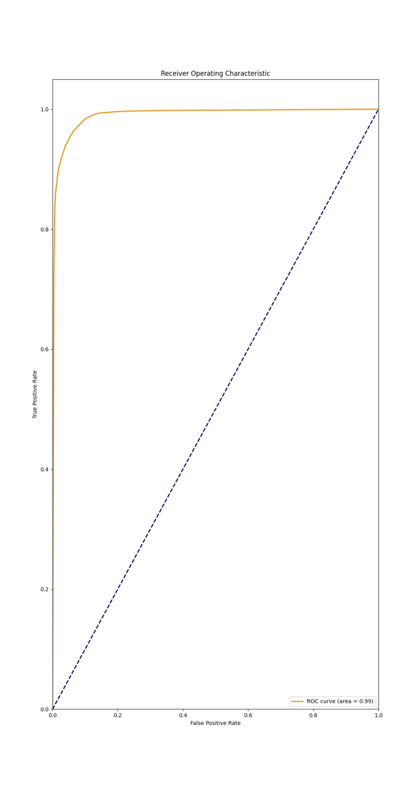

# Cancer-Detection-using-ML

# Cancer Detection Machine Learning Project

## Overview

#### Cancer Detection is perhaps the simplest ML projects. I have built this small project for just a simple Overview of ML techniques.
This project aims to develop a machine learning model for detecting cancer using a synthetic dataset. The dataset contains 100,000 samples with various features that are correlated with the presence of cancer. The primary goal is to achieve high accuracy in cancer detection through effective data preprocessing, model training, and evaluation.

## Dataset

The dataset consists of 100,000 samples with the following features:

- `age`: Patient's age (20 to 80 years).
- `tumor_size`: Size of the tumor in centimeters.
- `genetic_marker_1` to `genetic_marker_5`: Binary genetic markers indicating the presence (1) or absence (0) of specific genetic traits.
- `family_history`: Binary indicator of family history of cancer.
- `cancer`: Binary target variable indicating the presence (1) or absence (0) of cancer.

### Data Generation

The dataset is generated with specific correlations between features and the target variable to create a more realistic and challenging machine learning problem.

## Model

A Random Forest classifier is used to train the model, chosen for its robustness and ability to handle complex patterns in the data.

### Steps

1. **Data Generation**: Create a synthetic dataset with meaningful patterns.
2. **Data Preprocessing**: Standardize the feature variables.
3. **Model Training**: Train a Random Forest classifier on the preprocessed data.
4. **Model Evaluation**: Evaluate the model's performance using accuracy, confusion matrix, classification report, and ROC AUC.

## Results

- **Accuracy**: 95.06%
- **Confusion Matrix**:- 
                         [ 8548,  525]
                         [  463, 10464]
                                       
- **ROC AUC**: 0.99

### ROC Curve

The ROC curve demonstrates the model's excellent discriminative ability with an AUC of 0.99.



## Usage

### Requirements

- Python 3.x
- Required libraries: pandas, numpy, scikit-learn, matplotlib

### Installation

```
pip install pandas numpy scikit-learn matplotlib
